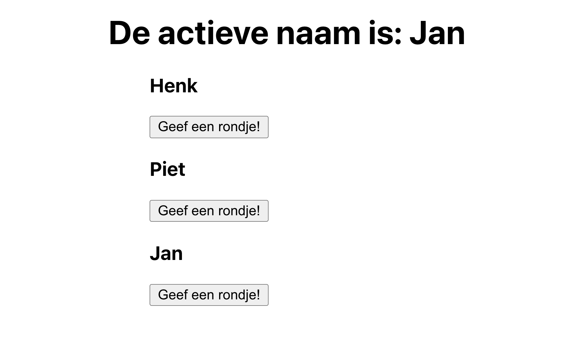

# Opdrachtbeschrijving
Je gaat een applicatie maken die bijhoudt wie er op dit moment een rondje geeft!

Wanneer het component voor het eerst gerenderd wordt, wil je dit in de console loggen. En wanneer de persoon die een rondje geeft veranderd, log je dit ook in de console.
Hier zul je dus twee life cycle effecten voor moeten toepassen! Volg de stapjes in het onderstaande stappenplan.

## Applicatie starten
Als je het project gecloned hebt naar jouw locale machine, installeer je eerst de node_modules door het volgende commando in de terminal te runnen:

`npm install`

Wanneer dit klaar is, kun je de applicatie starten met behulp van:

`npm start`

of gebruik de WebStorm knop (npm start). Open http://localhost:3000 om de pagina in de browser te bekijken. Begin met het maken van wijzigingen in src/App.js: elke keer als je een bestand opslaat, zullen de wijzigingen te zien zijn op de webpagina.

## Stappenplan
1. Maak in `App.js` een stukje state aan voor de actieve naam (`activeName`) die op dat moment een rondje geeft;
2. Geef de _waarde_ daarvan en de _setter functie_ mee aan alle `<NameItem />` componenten;
3. Maak de buttons in de `<NameItem />` componenten functioneel: wanneer de gebruiker op die button klikt, wordt die specifieke naam in de state van `App.js` geplaatst.
4. Zorg ervoor dat er vanuit `App.js` het volgende gebeurt doormiddel van Life Cycles:
   * Alléén als de pagina gerefresht wordt, wordt er `"We gaan beginnen!"` gelogd. _Tip_: kies een leuke emoji ter referentie
5. Zorg ervoor dat er vanuit `NameItem.js` het volgende gebeurt doormiddel van Life Cycles:
   * Alléén als het component gemount wordt, wordt er `"<naam> is in de DOM geplaatst"` gelogd
   * Zorg dat er geluisterd wordt naar de verandering van de actieve naam (als iemand een "Geef een rondje!" button aanklikt en de state veranderd). Komt de huidige actieve naam overeen met de naam van dat `<NameItem>`? Dan wordt er `"<naam> wil graag een biertje bestellen"` gelogd.
